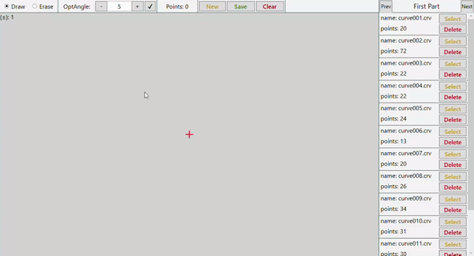
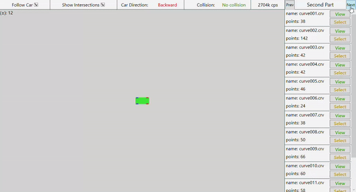

# Neural Network Training for 2D Driving Simulation

This project aims to provide practical experience in training a neural network using genetic algorithms for a 2D driving simulation. The goal is to develop an AI agent capable of autonomous driving in a simulated environment. The project involves multiple stages, with the neural network training being the focal point. The current status of each stage is outlined below.

## Plan

1. **Curve Editor** - Create a user-friendly curve editor for track creation and modification.
   - Status: Completed
   - 

2. **Testing Environment** - Create a simulation environment with a car that includes vision, collision detection, and custom track features.
   - Status: Completed
   - Features:
     - Manual Control: You can control the car manually to evaluate its performance.
     - 

3. **Genetic Algorithm Implementation** - Implement a genetic algorithm to enable the car to drive autonomously and generate datasets of state-action pairs for training.
   - Status: Almost complete, pending UI enhancements and final touches
   - Features:
     - Autonomous Driving: The car drives autonomously in the simulation environment using the genetic algorithm.
     - 

4. **Neural Network Training** - Train a neural network using the generated dataset to achieve autonomous driving capabilities.
   - Status: Not started

## Getting Started

### Prerequisites

- Visual Studio
- .NET

### Installation

1. Clone the repository:

   ```shell
   git clone https://github.com/oleh-26-01/Project-One
   ```

2. Open the project in Visual Studio.

3. Build the project to resolve dependencies.

### Usage

1. Run the application in Visual Studio.

2. Use the curve editor to create or modify tracks for the simulation.

3. Explore the testing environment to manually control the car and evaluate its performance.
   - Use the controls to steer the car and observe how it navigates the track.
   - Adjust various parameters to test different scenarios and track designs.

4. Execute the genetic algorithm to search for optimal solutions for tracks.
   - Use the genetic algorithm implementation to search for the best track solution based on specified criteria.
   - Observe the progress and results of the genetic algorithm as it evolves solutions.

Note: At this stage, the project focuses on using the genetic algorithm to search for optimal track solutions. The creation of datasets and training of the neural network are not implemented yet. The emphasis is on refining the genetic algorithm to find the best track designs.

## Contributing

Contributions to the project are welcome. If you find any issues or have suggestions for improvements, please feel free to open an issue or submit a pull request.
